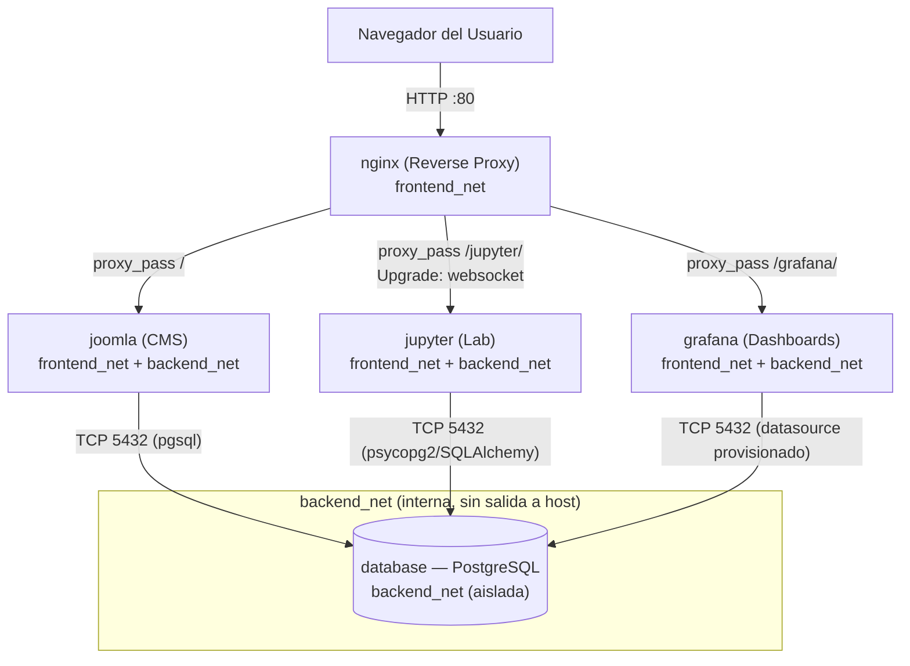

# INFORME.md — Parcial 2: Despliegue Multi-contenedor, Orquestación y Análisis OSI

**Comunicaciones — Ingeniería Mecatrónica — Universidad Militar Nueva Granada**

---

## Sección 1: Topología y Flujo de Información

### 1.1 Diagrama de arquitectura



### 1.2 Mecanismo de recolección de logs/métricas

No se implementa un pipeline de *log shipping* (tipo Loki/Filebeat) porque el enunciado
permite alternativamente **métricas de actividad extraídas directamente de PostgreSQL**,
que es la ruta elegida aquí por ser 100% determinista y no depender del prefijo de tablas
aleatorio que Joomla asigna en su instalación desatendida:

1. **Nginx** registra cada petición (incluidas las dirigidas a Joomla) en
   `access.log` con el formato `proxy_access` definido en `nginx/default.conf`
   (IP origen, status HTTP, upstream, tiempo de respuesta). Este log queda persistido en
   el volumen `nginx_logs` como evidencia y para inspección manual (`docker compose logs nginx`).
2. Cada visita al portal Joomla dispara lecturas/escrituras contra PostgreSQL
   (sesión de usuario, consultas de contenido). PostgreSQL expone esta actividad en
   tiempo real a través de sus **vistas de estadísticas del sistema**:
   - `pg_stat_activity`: conexiones activas por IP/cliente → *proxy* de "IPs recurrentes".
   - `pg_stat_user_tables`: contadores acumulados de `INSERT`/`UPDATE`/`DELETE` por tabla
     → *proxy* de volumen de tráfico/actividad del CMS.
3. **Grafana** consulta esas vistas mediante el datasource `PostgreSQL-Joomla`
   (`grafana/provisioning/datasources/datasource.yml`), provisionado automáticamente al
   arrancar el contenedor — sin pasos manuales en la UI.
4. Los paneles (`grafana/provisioning/dashboards/joomla_logs.json`) ejecutan esas mismas
   consultas SQL cada 10 segundos (`refresh: "10s"`), por lo que reflejan tráfico real
   generado al navegar el sitio.
5. **Jupyter** replica exactamente las mismas consultas SQL en `analisis_datos.ipynb`
   usando `sqlalchemy`/`psycopg2`, permitiendo el análisis exploratorio fuera de Grafana.

---

## Sección 2: Análisis Detallado del Modelo OSI en la Solución

### 2.1 Capa 7 — Aplicación

- **Cabeceras HTTP inyectadas por Nginx**: en cada `location` del `default.conf` se
  añaden `Host` (preserva el nombre de host original que ve el navegador, necesario para
  que Joomla genere URLs correctas), `X-Real-IP` y `X-Forwarded-For` (preservan la IP
  real del cliente, que de otro modo Joomla/Jupyter/Grafana verían como `127.0.0.1` o la
  IP interna de `nginx`, ya que desde su perspectiva la conexión TCP la origina el proxy)
  y `X-Forwarded-Proto` (indica si la petición original fue HTTP o HTTPS, relevante para
  que las aplicaciones backend generen enlaces absolutos correctos).
- **HTTP Upgrade para WebSockets de Jupyter**: el protocolo del kernel de Jupyter viaja
  sobre WebSocket, que se negocia con una petición HTTP `GET` que incluye
  `Connection: Upgrade` y `Upgrade: websocket`. Nginx, por defecto, no reenvía estas
  cabeceras porque normalmente actúa como intermediario HTTP puro; por eso es obligatorio
  declarar explícitamente `proxy_http_version 1.1;`, `proxy_set_header Upgrade
  $http_upgrade;` y `proxy_set_header Connection "upgrade";` en el bloque `location
  /jupyter/`. Sin esto, la interfaz carga pero el kernel nunca conecta ("Kernel
  connection error"), justo el síntoma que advierte el enunciado.
- **Protocolo de aplicación de PostgreSQL**: es un protocolo binario propio
  cliente/servidor (no HTTP) sobre TCP/5432, basado en un ciclo de mensajes
  *startup → autenticación → query/simple o extended protocol → resultados en formato
  binario o texto (`RowDescription`/`DataRow`)*. Joomla, Jupyter y Grafana no hablan
  este protocolo "a mano": usan bibliotecas cliente (`pdo_pgsql` en Joomla,
  `psycopg2`/`SQLAlchemy` en Jupyter, el driver Go interno de Grafana) que lo
  implementan.
- **Formato de logs de Joomla**: el *access log* centralizado (generado por Nginx, ya
  que Joomla corre internamente sobre Apache sin puerto expuesto al host) sigue el
  formato definido en `log_format proxy_access`: IP, timestamp, línea de petición,
  código de estado, bytes servidos, referer, user-agent, upstream y tiempo de respuesta
  — un superconjunto del *Combined Log Format* típico de servidores web.

### 2.2 Capa 4 — Transporte

- **Puertos TCP involucrados**: `80` (Nginx, único puerto publicado al host), `5432`
  (PostgreSQL, sólo alcanzable dentro de `backend_net`), `8888` (Jupyter, interno,
  alcanzado por Nginx vía `frontend_net`) y `3000` (Grafana, interno, igual mecanismo).
  Ningún puerto salvo el 80 se publica con `ports:` en `docker-compose.yml`, por lo que
  5432/8888/3000 sólo son visibles *dentro* de las redes Docker, nunca desde fuera del
  host.
- **Conexiones concurrentes y persistentes**: Nginx abre hacia Joomla una conexión TCP
  por petición entrante (o reutiliza *keep-alive* HTTP/1.1 hacia el cliente), mientras
  que Joomla mantiene hacia PostgreSQL conexiones más duraderas por proceso PHP-Apache
  (no hay *pooling* explícito como PgBouncer en este stack; cada *worker* de Apache
  puede abrir su propia conexión, visibles individualmente en `pg_stat_activity`, que es
  justo lo que grafica el dashboard de Grafana). El healthcheck `pg_isready` de
  PostgreSQL usa su propia conexión TCP corta cada 5s para validar disponibilidad antes
  de que `joomla`, `jupyter` y `grafana` intenten conectarse (`depends_on: condition:
  service_healthy`), evitando errores de conexión rechazada durante el arranque en frío.

### 2.3 Capa 3 — Red

- **Direccionamiento IP y aislamiento**: Docker asigna una subred `bridge` distinta a
  cada red declarada (`frontend_net` y `backend_net`), con un rango de IPs propio
  (por ejemplo `172.x.0.0/16`, asignado automáticamente por el *daemon*). `database`
  sólo tiene interfaz en `backend_net`, por lo que no posee ninguna IP enrutable desde
  `frontend_net` ni desde el host: un intento de conexión desde `nginx` o desde fuera del
  clúster hacia `database:5432` falla porque, a nivel de capa 3, ni siquiera existe una
  ruta hacia esa interfaz.
- **DNS embebido de Docker (127.0.0.11)**: cada contenedor recibe un `resolv.conf` que
  apunta al servidor DNS interno de Docker en `127.0.0.11`. Este servidor resuelve los
  nombres de servicio declarados en `docker-compose.yml` (`database`, `joomla`,
  `jupyter`, `grafana`) a la IP interna correspondiente *dentro de cada red a la que
  pertenece el contenedor solicitante* — por eso `nginx` puede resolver `joomla`,
  `jupyter` y `grafana` (comparten `frontend_net`), y `joomla`/`jupyter`/`grafana` pueden
  resolver `database` (comparten `backend_net`), pero `nginx` **no** puede resolver
  `database` porque no está conectado a esa red.
- **NAT gestionado por el kernel del host**: Docker configura reglas `iptables`
  (tabla `nat`, cadena `DOCKER`) que hacen *port forwarding* del puerto `80` del host
  hacia la IP interna de `nginx` en `frontend_net` (mapeo `80:80`), y reglas de
  *masquerading* para que el tráfico saliente de los contenedores (p. ej. `jupyter`
  descargando paquetes) salga con la IP del host. Esto ocurre íntegramente en el kernel
  Linux del host, de forma transparente a los contenedores.

### 2.4 Capa 2 — Enlace de Datos

- **Interfaces virtuales y puentes**: por cada red bridge (`frontend_net`,
  `backend_net`) Docker crea un puente Linux (`br-xxxxxxxx`, visible con `ip link` o
  `brctl show`) y, por cada contenedor conectado a esa red, un par de interfaces
  virtuales `veth*` — una vive dentro del *network namespace* del contenedor
  (aparece como `eth0`/`eth1`) y su pareja queda enganchada al puente en el namespace
  del host. El puente actúa como un switch de capa 2 software.
- **ARP interno entre contenedores**: cuando `nginx` necesita enviar una trama a
  `joomla` dentro de `frontend_net`, primero resuelve la IP interna de `joomla` (obtenida
  vía DNS de Docker) a su dirección MAC mediante una petición **ARP broadcast** sobre el
  puente `br-xxxxxxxx`; `joomla` responde con su MAC y a partir de ahí la comunicación
  ocurre por *unicast* dentro del mismo dominio de colisión virtual. Como `database`
  vive en un puente Linux distinto (`backend_net`), nunca comparte dominio de
  *broadcast*/ARP con `nginx`, reforzando el aislamiento ya impuesto en capa 3.

---

## Sección 3: Guía de Verificación y Demostración

1. **Portal Joomla vía Nginx**
   ```bash
   docker compose up -d
   # esperar ~60s a que Joomla termine la instalación desatendida
   xdg-open http://localhost/        # o abrir manualmente en el navegador
   ```
   Navegar por 2-3 páginas del sitio para generar tráfico real (sesiones, consultas SQL).

2. **Grafana refleja la actividad**
   ```bash
   xdg-open http://localhost/grafana/
   # usuario: admin / contraseña: la definida en .env (GF_SECURITY_ADMIN_PASSWORD)
   ```
   Abrir el dashboard **"Actividad Joomla / PostgreSQL - Parcial COMM"** (ya provisionado,
   sin crear datasource ni panel manualmente) y confirmar que las gráficas de
   *conexiones por IP* y *escrituras por tabla* cambian tras refrescar el portal Joomla.

3. **Jupyter y el notebook precargado**
   ```bash
   xdg-open http://localhost/jupyter/
   # token: el definido en .env (JUPYTER_TOKEN)
   ```
   Abrir `work/analisis_datos.ipynb` (ya está ahí, montado por bind-mount) y ejecutar
   todas las celdas (`Run All`): debe conectarse a PostgreSQL, listar las tablas creadas
   por Joomla y graficar la actividad de escritura sin necesidad de instalar nada
   adicional (las librerías ya vienen en la imagen construida por `jupyter/Dockerfile`).

4. **Verificación de aislamiento de red (opcional, para sustentar la Sección 2.3)**
   ```bash
   docker compose exec nginx sh -c "nc -zv database 5432 2>&1 || echo 'sin ruta: aislamiento OK'"
   ```
