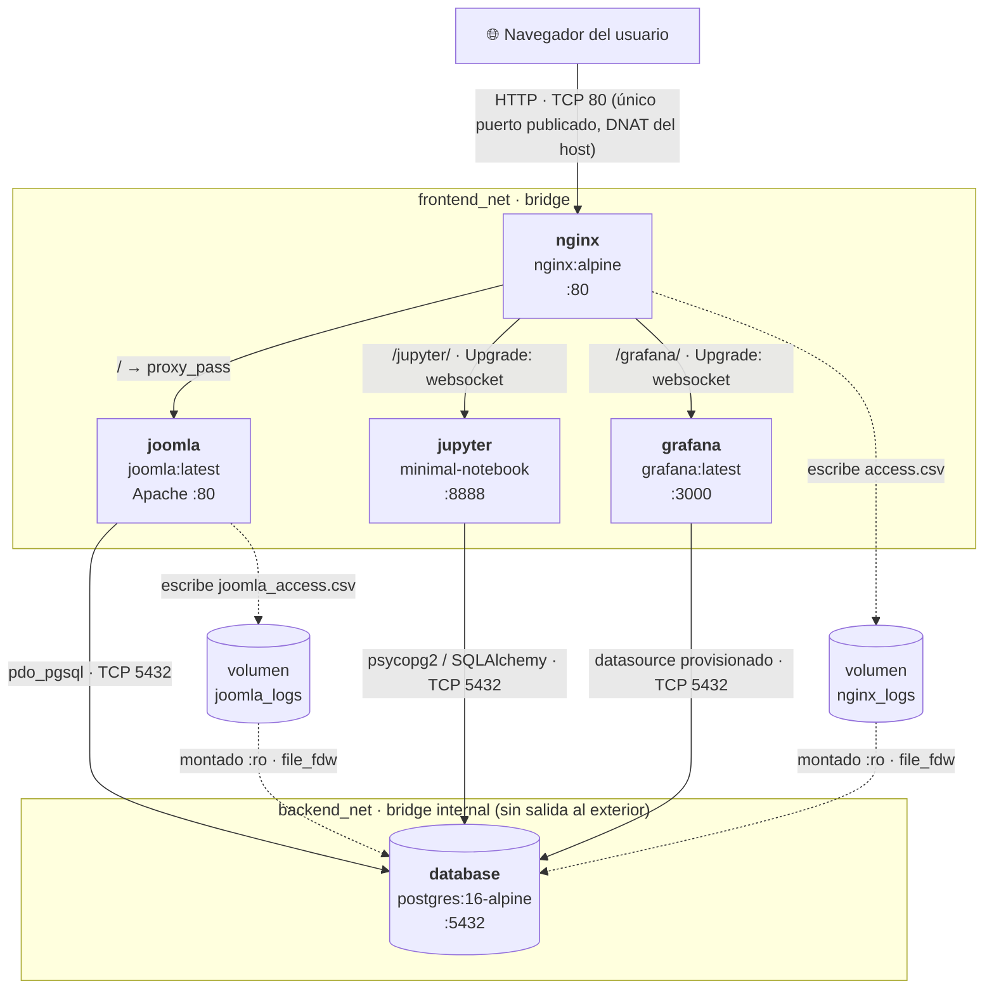

# INFORME.md — Parcial 2: Despliegue Multi-contenedor, Orquestación y Análisis OSI

**Comunicaciones — Ingeniería Mecatrónica — Universidad Militar Nueva Granada**

---

## Sección 1: Topología y Flujo de Información

### 1.1 Diagrama de arquitectura



| Contenedor | Imagen | Redes | Puerto interno | Volúmenes |
|---|---|---|---|---|
| `nginx` | `nginx:alpine` | frontend_net | 80 (**publicado 80:80**) | carpeta `nginx/` (bind, contiene `default.conf`), `nginx_logs` |
| `joomla` | `joomla:latest` | frontend_net, backend_net | 80 | `joomla_data` (assets), `joomla_logs`, carpeta `joomla/` (bind: `apache-logs.conf` + `seed/`) |
| `database` | `postgres:16-alpine` | **sólo** backend_net | 5432 | `postgres_data` → `/var/lib/postgresql/data`, `database/init` (bind), logs `:ro` |
| `jupyter` | build de `jupyter/minimal-notebook` | frontend_net, backend_net | 8888 | `./jupyter/notebooks` → `/home/jovyan/work` (bind) |
| `grafana` | `grafana/grafana:latest` | frontend_net, backend_net | 3000 | `grafana/provisioning` (bind), `grafana_data`, logs `:ro` |

`backend_net` se declara con `internal: true`: Docker no le asigna gateway ni reglas de
*masquerading*, de modo que `database` no tiene ninguna ruta hacia el host ni hacia internet.
Los contenedores que están en ambas redes (`joomla`, `jupyter`, `grafana`) salen al exterior
sólo por `frontend_net`.

### 1.2 Mecanismo de recolección de logs y métricas

El objetivo es que Grafana muestre **los logs reales de acceso a Joomla** sin añadir
contenedores extra (Loki, Promtail, Filebeat…) y sin pasos manuales. La solución usa
volúmenes compartidos y la extensión **`file_fdw`** de PostgreSQL, que permite consultar un
archivo CSV como si fuera una tabla:

```
 navegador ──HTTP──► nginx ──proxy_pass──► joomla (Apache + PHP) ──SQL──► PostgreSQL
                      │                      │
            access.csv (nginx_logs)   joomla_access.csv (joomla_logs)
                      │                      │
                      └──────► montados :ro en database ◄──────┘
                                       │  file_fdw  →  esquema "monitoring"
                                       ▼
                     Grafana (dashboards)  ·  Jupyter (analisis_datos.ipynb)
```

1. **Nginx** escribe cada petición en `/var/log/nginx/access.csv` con el formato `csv_access`
   (`log_format … escape=json`): epoch con milisegundos, IP origen, servicio de destino
   (calculado con un `map` sobre la URI), método, URI, protocolo, código HTTP, bytes, tiempo
   total (`$request_time`), tiempo del upstream, dirección del upstream, referer y user-agent.
   En paralelo, envía una línea legible a `stdout` para `docker compose logs nginx`.
   > En la imagen oficial `access.log` es un *symlink* a `/dev/stdout`; por eso se usa un
   > archivo con nombre propio, que sí queda persistido en el volumen.
2. **Joomla (Apache)** carga `joomla/apache-logs.conf` (`start.sh` lo enlaza en
   `conf-enabled/` al arrancar), que usa `GlobalLog` para escribir
   `/var/log/apache2/joomla_access.csv` (volumen `joomla_logs`): epoch en ms, IP del cliente
   real (recuperada de `X-Forwarded-For` con `mod_remoteip`), IP del proxy, línea de
   petición, código, bytes, duración en microsegundos (`%D`), referer y user-agent.
3. **PostgreSQL** monta ambos volúmenes en sólo lectura (`/logs/nginx`, `/logs/joomla`).
   El script `database/init/01-monitoring.sql`, ejecutado automáticamente por
   `docker-entrypoint-initdb.d` al inicializar la base, crea:
   - las tablas foráneas `monitoring.nginx_access_raw` y `monitoring.joomla_access_raw`;
   - las vistas tipadas `monitoring.nginx_access` y `monitoring.joomla_access`, que
     convierten el epoch a `timestamptz`, el status a entero, calculan la clase (`2xx`,
     `4xx`…), separan la ruta de la *query string* y clasifican el user-agent.

   `file_fdw` lee el archivo en cada consulta, así que los datos están en tiempo casi real.
   La base de datos sigue aislada en `backend_net`: los logs le llegan por el sistema de
   archivos (volumen), no por la red.
4. **Métricas de actividad del motor**: las vistas del sistema `pg_stat_activity`
   (conexiones, IP cliente, estado), `pg_stat_user_tables` (inserts/updates/deletes y
   lecturas por tabla) y `pg_stat_database` (cache hit, transacciones).
5. **Grafana** arranca con el datasource `PostgreSQL-Joomla`
   (`grafana/provisioning/datasources/datasource.yml`) y dos dashboards provisionados en la
   carpeta *Parcial COMM* (`grafana/provisioning/dashboards/*.json`), todo declarativo e
   inmutable (`allowUiUpdates: false`). El de tráfico es además el *home dashboard* y se
   puede ver sin iniciar sesión (rol anónimo `Viewer`):
   - **Tráfico HTTP y logs — Nginx / Joomla** (refresco 10 s): peticiones, peticiones/min,
     tasa de error, latencia p95, IPs únicas y bytes servidos; peticiones por clase de
     código HTTP en el tiempo; donut de clases de respuesta; latencia p50/p95/máx.; tráfico
     por servicio (joomla/jupyter/grafana); top 10 IPs; rutas más solicitadas; tipo de
     cliente; peticiones y tiempo de PHP vistos desde Apache; errores 4xx/5xx recientes y
     un panel de *logs* en vivo coloreado por severidad. Tiene una variable `Servicio` para
     filtrar.
   - **PostgreSQL — Actividad de la base de datos**: conexiones, tamaño, cache hit ratio,
     transacciones, número de tablas y uptime; conexiones por cliente/estado; escrituras por
     tabla; lecturas vs. escrituras; sesiones activas.
6. **Jupyter** consulta exactamente las mismas vistas desde `analisis_datos.ipynb`.

---

## Sección 2: Análisis Detallado del Modelo OSI en la Solución

### 2.1 Capa 7 — Aplicación

- **Cabeceras HTTP inyectadas por Nginx** (`nginx/default.conf`):
  - `Host $host`: conserva el nombre que escribió el usuario (p. ej. `localhost`). Sin ella
    el backend vería `joomla` o `grafana:3000` y generaría URLs absolutas incorrectas.
  - `X-Real-IP` y `X-Forwarded-For`: desde el punto de vista de TCP, el cliente de Joomla,
    Jupyter y Grafana es el proxy. Estas cabeceras transportan la IP original. Apache la
    restaura con `mod_remoteip` (`RemoteIPHeader X-Forwarded-For`), y por eso
    `joomla_access.csv` contiene a la vez la IP del cliente real y la IP de Nginx (`%{c}a`).
  - `X-Forwarded-Proto $scheme` y `X-Forwarded-Host`: informan si la petición original fue
    HTTP o HTTPS y a qué host se dirigía, para que los backends construyan redirecciones y
    enlaces coherentes.
- **HTTP Upgrade para los WebSockets del kernel de Jupyter**: JupyterLab se comunica con el
  kernel por WebSocket (`/jupyter/api/kernels/<id>/channels`). La conexión empieza como un
  `GET` HTTP/1.1 con `Upgrade: websocket` y `Connection: Upgrade`. Estas cabeceras son
  *hop-by-hop* y Nginx no las reenvía por defecto, así que en `location /jupyter/` (y en
  `/grafana/`, para Grafana Live) se declara:
  ```nginx
  proxy_http_version 1.1;
  proxy_set_header Upgrade    $http_upgrade;
  proxy_set_header Connection $connection_upgrade;   # map: "upgrade" o "close"
  proxy_read_timeout 86400s;                           # el socket del kernel es de larga vida
  ```
  El servidor responde `101 Switching Protocols` y, desde ese momento, el mismo socket TCP
  transporta tramas WebSocket bidireccionales. Esas respuestas `101` aparecen en Grafana
  como la clase `1xx · Upgrade WebSocket`.
- **Protocolo cliente/servidor de PostgreSQL** (*Frontend/Backend Protocol v3*): es binario y
  orientado a mensajes, sobre TCP 5432. El cliente envía `StartupMessage` (usuario, base,
  `application_name`), el servidor pide autenticación (SCRAM-SHA-256 en PostgreSQL 16) y
  responde `AuthenticationOk`, `ParameterStatus` y `ReadyForQuery`. Cada consulta viaja como
  `Query` (protocolo simple) o como `Parse/Bind/Execute` (protocolo extendido, el que usa PDO
  con *prepared statements*). Los resultados vuelven como `RowDescription` seguido de N
  `DataRow` y `CommandComplete`. Joomla usa `pdo_pgsql`, Jupyter usa `psycopg2` (libpq) y
  Grafana usa el driver Go `pgx`. El cuaderno se identifica con `application_name=jupyter`,
  visible en `pg_stat_activity`.
- **Formato y estructura de los logs**:
  - Nginx (`access.csv`), una línea por petición:
    `"1790963436.907","172.19.0.2","jupyter","GET","/jupyter/api/status","HTTP/1.1","403","40","0.002","0.002","172.19.0.2:8888","","python-urllib (Jupyter demo)"`
  - Apache/Joomla (`joomla_access.csv`):
    `"1790963436844","172.19.0.2","172.19.0.5","GET /wp-login.php HTTP/1.1","404","4009","58833","-","python-urllib (Jupyter demo)"`

  Son una extensión del *Combined Log Format* en CSV. Las comillas y barras invertidas se
  escapan con `\`, lo que coincide con la opción `escape '\'` de `file_fdw`. En el ejemplo,
  Apache ve como cliente real a `172.19.0.2` (Jupyter) y como par TCP a `172.19.0.5`
  (Nginx), y mide 58,8 ms de procesamiento PHP para un 404 de Joomla.

### 2.2 Capa 4 — Transporte

- **Puertos TCP**:

  | Puerto | Servicio | Visibilidad |
  |---|---|---|
  | 80 | Nginx | publicado en el host (`ports: "80:80"`), único punto de entrada |
  | 80 | Apache (Joomla) | sólo `frontend_net` (lo alcanza Nginx) |
  | 8888 | Jupyter | sólo `frontend_net` |
  | 3000 | Grafana | sólo `frontend_net` |
  | 5432 | PostgreSQL | sólo `backend_net` (Joomla, Jupyter, Grafana) |

  Los puertos 8888, 3000 y 5432 no se publican (`expose` implícito de la imagen), así que
  desde fuera del host sólo responde el 80.
- **Conexiones concurrentes y persistentes**:
  - *Cliente ↔ Nginx*: HTTP/1.1 con `keep-alive`. El navegador reutiliza la misma conexión
    TCP para varias peticiones (HTML, CSS, JS), lo que ahorra el *three-way handshake*.
  - *Nginx ↔ Joomla*: Nginx actúa como cliente TCP independiente hacia `joomla:80`. Como
    `proxy_pass` usa una variable resuelta por DNS en lugar de un bloque `upstream` con
    `keepalive N`, no se configura un pool de conexiones reutilizables hacia el backend, y
    la conexión del navegador y la del proxy son dos sesiones TCP distintas. El coste de abrir
    conexiones nuevas es bajo porque ocurre dentro del mismo host (sobre un bridge virtual,
    con RTT de microsegundos). La diferencia entre
    `request_time` (Nginx) y `duracion_ms` (Apache) en los dashboards mide justamente ese
    coste del proxy.
  - *Nginx ↔ Jupyter/Grafana (WebSocket)*: tras el `101`, la conexión TCP queda abierta
    indefinidamente (`proxy_read_timeout 86400s`).
  - *Joomla ↔ PostgreSQL*: PHP abre una conexión por petición y la cierra al terminar
    (PDO no persistente), por lo que cada visita produce un handshake TCP y una
    autenticación nuevos. Se ve en `pg_stat_activity` como conexiones de vida corta.
  - *Grafana ↔ PostgreSQL*: el driver Go mantiene un **pool** de conexiones
    (`maxOpenConns: 10`, `maxIdleConns: 5`, `connMaxLifetime: 14400` en el datasource). Las
    conexiones en estado `idle` del panel *Sesiones activas* son ese pool reutilizándose.
  - *Jupyter ↔ PostgreSQL*: SQLAlchemy también usa un pool (`QueuePool`) con
    `pool_pre_ping=True`, que valida la conexión antes de reutilizarla.
  - *Healthcheck* `pg_isready`: abre una conexión TCP corta cada 5 s. `depends_on:
    condition: service_healthy` impide que Joomla, Jupyter y Grafana intenten conectarse
    antes de que PostgreSQL acepte conexiones.

### 2.3 Capa 3 — Red

- **Direccionamiento IP y aislamiento**: cada red declarada en `docker-compose.yml` es una
  subred distinta asignada por el *daemon* (en las pruebas: `frontend_net = 172.19.0.0/16`,
  `backend_net = 172.20.0.0/16`). Los contenedores con dos redes tienen dos interfaces
  (`eth0`, `eth1`), una IP en cada subred. `database` sólo tiene IP en `backend_net`. Como
  esa red es `internal: true`, no tiene gateway: desde `nginx` no existe ninguna ruta hacia
  `database`, y desde `database` no existe ruta hacia internet. Las IPs reales se ven en
  Jupyter (sección 1 del cuaderno) y en Grafana (*Conexiones por cliente*).
- **DNS embebido de Docker (127.0.0.11)**: en redes definidas por el usuario, Docker
  escribe `nameserver 127.0.0.11` en el `/etc/resolv.conf` de cada contenedor. Ese
  resolvedor (servido por el propio `dockerd` dentro del *namespace* de red del contenedor,
  con reglas `iptables` que redirigen el puerto 53) responde los nombres de servicio
  **sólo dentro de las redes que comparte el solicitante**. Por eso:
  - `nginx` resuelve `joomla`, `jupyter` y `grafana`, pero **no** `database`;
  - `joomla`, `jupyter` y `grafana` resuelven `database`;
  - Nginx declara `resolver 127.0.0.11 valid=10s;` y usa variables en `proxy_pass`. Así
    el nombre se vuelve a resolver periódicamente y, si un contenedor se recrea con otra IP,
    el proxy sigue funcionando sin reiniciarse.
- **Reenvío y NAT en el kernel del host**: Docker programa `iptables`/`nftables`:
  - **DNAT** (cadena `DOCKER` de la tabla `nat`): `tcp dpt:80 → <IP de nginx>:80`. Así una
    conexión al puerto 80 del host se reescribe hacia el contenedor. Por eso Nginx registra
    como IP del cliente la **gateway del bridge** (`172.19.0.1`) cuando se accede desde el
    propio host.
  - **MASQUERADE** (cadena `POSTROUTING`): el tráfico que sale de `frontend_net` hacia
    internet toma la IP del host. `backend_net` no tiene regla de MASQUERADE por ser
    interna.
  - **Filtrado** (cadenas `DOCKER-ISOLATION-STAGE-1/2` y `FORWARD`): el kernel descarta los
    paquetes que intentan cruzar de un bridge a otro. Hace falta `net.ipv4.ip_forward=1`,
    que Docker activa.

### 2.4 Capa 2 — Enlace de Datos

- **Interfaces virtuales y puentes**: por cada red Docker crea un puente Linux `br-<id>`
  que actúa como switch por software (aprende MACs por puerto, igual que un switch físico).
  Cada vez que un contenedor se conecta a una red se crea un par **veth**: un extremo queda
  dentro del *namespace* del contenedor como `eth0`/`eth1` y el otro (`vethXXXX`) se
  "enchufa" al puente en el *namespace* del host. Se puede ver con `ip link show master
  br-<id>` o `bridge link`. `joomla`, `jupyter` y `grafana` tienen dos pares veth (uno por
  puente). `nginx` y `database` tienen uno.
- **ARP interno**: cuando `jupyter` envía su primer paquete a `database`, el kernel del
  contenedor no conoce la MAC de destino. Emite un **ARP Request** en *broadcast*
  (`ff:ff:ff:ff:ff:ff`) por `eth1`, que el puente de `backend_net` reparte a todos sus
  puertos. `database` responde con un **ARP Reply** *unicast* y la entrada queda en caché
  (`/proc/net/arp`, que el cuaderno muestra en la sección 1). Las MACs las genera Docker
  dentro de un rango administrado localmente. Como
  `frontend_net` y `backend_net` son puentes distintos, sus dominios de *broadcast* están
  separados: `nginx` nunca recibe un ARP de `database`, lo que refuerza en capa 2 el
  aislamiento de capa 3.

---

## Sección 3: Guía de Verificación y Demostración

> Requisitos: Docker Engine 24+ con el plugin `docker compose`. El primer arranque descarga
> imágenes y construye la de Jupyter (~2–4 min). Joomla tarda ~1 min más en instalarse
> contra PostgreSQL.

```bash
git clone https://github.com/juan-swxs/parcial-redes-comunicaciones.git
cd parcial-redes-comunicaciones
docker compose up -d     # no requiere .env: las credenciales tienen valores por defecto
docker compose ps        # esperar a que los 5 servicios estén "healthy"
```

El paso `cp .env.example .env` del enunciado es opcional: si se ejecuta, el `.env`
resultante contiene los mismos valores que los predeterminados de `docker-compose.yml`.

1. **Abrir el portal Joomla a través de Nginx y generar tráfico**
   - Abrir <http://localhost/>. La portada ya trae contenido: un banner, 7 artículos sobre
     el proyecto con imágenes y accesos rápidos a Grafana y Jupyter. Lo carga
     automáticamente `joomla/seed/seed.php` al terminar la instalación desatendida.
   - Navegar por varias páginas (por ejemplo los artículos,
     <http://localhost/index.php/component/users/login>) y por una ruta inexistente como
     <http://localhost/no-existe> para producir un 404.
   - Opcional, desde la terminal:
     ```bash
     for i in $(seq 1 30); do curl -s -o /dev/null http://localhost/; curl -s -o /dev/null http://localhost/no-existe; done
     ```
   - Comprobar que Nginx registra el tráfico:
     ```bash
     docker compose exec nginx tail -n 3 /var/log/nginx/access.csv
     docker compose exec joomla tail -n 3 /var/log/apache2/joomla_access.csv
     ```

2. **Abrir Grafana y constatar que las gráficas reflejan las peticiones**
   - Abrir <http://localhost/grafana/>. Carga directamente el dashboard
     **"Tráfico HTTP y logs — Nginx / Joomla"** sin iniciar sesión (para editar: `admin` /
     `admin123`).
   - En ≤10 s, los contadores de *Peticiones*, las barras de *Peticiones por código HTTP* y
     el panel *Registro de accesos en vivo* muestran las visitas del paso 1. Los 404
     aparecen en naranja y en *Errores recientes*.
   - Con el enlace superior **"PostgreSQL — Actividad de la base de datos"** se ven las
     conexiones y escrituras que generó Joomla (p. ej. la tabla `session`).
   - No hubo que crear ningún datasource ni dashboard: están en *Connections → Data
     sources* y en la carpeta *Parcial COMM*, marcados como provisionados.

3. **Acceder a Jupyter y ejecutar el cuaderno**
   - Abrir <http://localhost/jupyter/> e introducir el token `parcial123` (`JUPYTER_TOKEN`
     en `.env`). JupyterLab abre directamente `analisis_datos.ipynb`.
   - Ejecutar **Run → Run All Cells**. El indicador del kernel debe quedar en *Idle*, lo que
     confirma que el WebSocket atraviesa Nginx. Las gráficas son interactivas (Plotly) y las
     tablas permiten buscar y ordenar (itables). El cuaderno:
     1. se conecta a PostgreSQL y muestra las IPs del servidor y del cliente;
     2. dibuja la topología real del despliegue con las IPs resueltas por el DNS
        `127.0.0.11` y muestra la tabla ARP del contenedor;
     3. genera tráfico de demostración a través de `http://nginx/`;
     4. a partir del log de Nginx muestra indicadores clave, una línea de tiempo con selector
        de rango, un *sunburst* servicio → clase → código, la distribución de latencias y un
        ranking conmutable (IPs / rutas / user-agents);
     5. ofrece un **explorador de logs** con filtros (servicio, clase, texto) que actualiza
        una gráfica y una tabla al instante;
     6. analiza el log de Apache (duración PHP por ruta y diagrama de flujo cliente → Nginx
        → Joomla);
     7. muestra indicadores de PostgreSQL, un mapa de tablas (*treemap*), las escrituras por
        tabla y las sesiones abiertas;
     8. cierra con un resumen en tarjetas.

4. **Verificación del aislamiento de red (sustenta la Sección 2.3)**
   ```bash
   # nginx NO resuelve ni alcanza la base de datos (no comparte backend_net)
   docker compose exec nginx sh -c "nc -zv -w2 database 5432 || echo 'aislamiento OK'"
   # joomla sí la alcanza
   docker compose exec joomla bash -c "echo > /dev/tcp/database/5432 && echo 'joomla → database:5432 OK'"
   # database no tiene salida a internet (backend_net es internal)
   docker compose exec database sh -c "wget -q -T3 -O /dev/null http://example.com || echo 'sin salida externa OK'"
   # redes, subredes y contenedores conectados
   docker network inspect parcial-redes-comunicaciones_backend_net --format '{{.Internal}} {{range .IPAM.Config}}{{.Subnet}}{{end}}'
   ```
